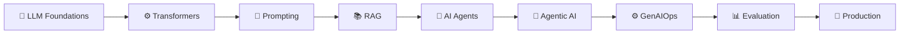

# 🚀 GenAIOps — 38 Day Learning Journey

### CGI Training | Generative AI • LLMs • AI Agents • GenAIOps

A day-wise record of my **38-day GenAIOps learning journey at CGI**, covering concepts, hands-on exercises, resources, and key learnings.

> **Learn → Explore → Build → Document → Reflect**

---

## 🗺️ Learning Journey



---

## 📅 38-Day Training Tracker

|   Day  | Topic / Module                            |            Notes           | Status |
| :----: | ----------------------------------------- | :------------------------: | :----: |
| **01** | Foundational LLM Architectures            | [View](./Day-01/README.md) |   🟢   |
| **02** | Transformers, Reasoning & Agent Lifecycle | [View](./Day-02/README.md) |   🟢   |
| **03** | Upcoming                                  | [View](./Day-03/README.md) |    ⚪   |
| **04** | Upcoming                                  | [View](./Day-04/README.md) |    ⚪   |
| **05** | Upcoming                                  | [View](./Day-05/README.md) |    ⚪   |
| **06** | Upcoming                                  | [View](./Day-06/README.md) |    ⚪   |
| **07** | Upcoming                                  | [View](./Day-07/README.md) |    ⚪   |
| **08** | Upcoming                                  | [View](./Day-08/README.md) |    ⚪   |
| **09** | Upcoming                                  | [View](./Day-09/README.md) |    ⚪   |
| **10** | Upcoming                                  | [View](./Day-10/README.md) |    ⚪   |
| **11** | Upcoming                                  | [View](./Day-11/README.md) |    ⚪   |
| **12** | Upcoming                                  | [View](./Day-12/README.md) |    ⚪   |
| **13** | Upcoming                                  | [View](./Day-13/README.md) |    ⚪   |
| **14** | Upcoming                                  | [View](./Day-14/README.md) |    ⚪   |
| **15** | Upcoming                                  | [View](./Day-15/README.md) |    ⚪   |
| **16** | Upcoming                                  | [View](./Day-16/README.md) |    ⚪   |
| **17** | Upcoming                                  | [View](./Day-17/README.md) |    ⚪   |
| **18** | Upcoming                                  | [View](./Day-18/README.md) |    ⚪   |
| **19** | Upcoming                                  | [View](./Day-19/README.md) |    ⚪   |
| **20** | Upcoming                                  | [View](./Day-20/README.md) |    ⚪   |
| **21** | Upcoming                                  | [View](./Day-21/README.md) |    ⚪   |
| **22** | Upcoming                                  | [View](./Day-22/README.md) |    ⚪   |
| **23** | Upcoming                                  | [View](./Day-23/README.md) |    ⚪   |
| **24** | Upcoming                                  | [View](./Day-24/README.md) |    ⚪   |
| **25** | Upcoming                                  | [View](./Day-25/README.md) |    ⚪   |
| **26** | Upcoming                                  | [View](./Day-26/README.md) |    ⚪   |
| **27** | Upcoming                                  | [View](./Day-27/README.md) |    ⚪   |
| **28** | Upcoming                                  | [View](./Day-28/README.md) |    ⚪   |
| **29** | Upcoming                                  | [View](./Day-29/README.md) |    ⚪   |
| **30** | Upcoming                                  | [View](./Day-30/README.md) |    ⚪   |
| **31** | Upcoming                                  | [View](./Day-31/README.md) |    ⚪   |
| **32** | Upcoming                                  | [View](./Day-32/README.md) |    ⚪   |
| **33** | Upcoming                                  | [View](./Day-33/README.md) |    ⚪   |
| **34** | Upcoming                                  | [View](./Day-34/README.md) |    ⚪   |
| **35** | Upcoming                                  | [View](./Day-35/README.md) |    ⚪   |
| **36** | Upcoming                                  | [View](./Day-36/README.md) |    ⚪   |
| **37** | Upcoming                                  | [View](./Day-37/README.md) |    ⚪   |
| **38** | Upcoming                                  | [View](./Day-38/README.md) |    ⚪   |

**Legend:** 🟢 Completed   🟡 In Progress   ⚪ Upcoming

---

## 📂 Repository Structure

Each training day contains only the essential learning artifacts:

```text
cgitraining/
│
├── 📄 README.md
│
├── 📁 Day-01/
│   ├── 📄 README.md
│   ├── 📓 Notebook.ipynb
│   └── 💻 Code/
│
├── 📁 Day-02/
│   ├── 📄 README.md
│   ├── 📓 Notebook.ipynb
│   └── 💻 Code/
│
├── 📁 Day-03/
│   ├── 📄 README.md
│   ├── 📓 Notebook.ipynb
│   └── 💻 Code/
│
├── ...
│
└── 📁 Day-38/
    ├── 📄 README.md
    ├── 📓 Notebook.ipynb
    └── 💻 Code/
```

> **README** → Concepts & key learnings
> **Notebook** → Hands-on exploration & experiments
> **Code** → Practical implementations

---

> 🚀 **38 Days • One Learning Journey • Building GenAI Skills**

*This README will be updated throughout the training.*
